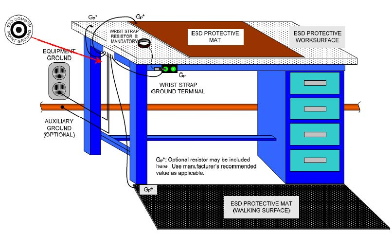

# ESD Control Plan
Author Lori Harrison ESC Cog-E/I&T Lead
lorih@arizona.edu

The  purpose  of this  document  is  to  present  a  standardized administrative  and  technical  baseline  for development  of an  organization’s  ESD Control  Program  Plan. 

ESD safety  and  control  requirements  are  intended  to  apply  to  all  ESDS devices used for spaceflight hardware. This  baseline  should  also  be  applied  to  hardware  production  where  the  end item  may  not  be  mission-critical  yet  is  expensive  to  replace,  or is  a  long-lead  item.

## Acronyms and Abbreviations

| Phrase/Acroynm               |Description                          |
|-------------------------|-------------------------------|
|AC | Alternating Current |
|CPG | Common Point Ground |
|DC | Direct Current |
|DMM | Digital Multimeter |
|EMI | Electromagnetic Interference |
|ESC | Extra Solar Camera |
|ESD | Electro-static Discharge |
| ESDS| ESD sensitive |
|RH | Relative Humidity |
|UUT| Unit under test |

## Definitions
| Term               |Definition                          |
|-------------------------|-------------------------------|
|Assembly | A functional subdivision of a component, consisting of parts or subassemblies, which perform functions necessary for the operation of the component as a whole. Examples: regulator assembly, power amplifier assembly, gyro assembly, etc. |
|Cheater Plug| An Alternating Current (AC) plug adapter used to connect a three-pronged plug to a two-pronged AC socket. It can be used to separate the ground wire from the socket for testing purposes. |
|Component| A functional subdivision of a system, generally a self-contained combination of assemblies performing a function necessary for the system's operation. Examples: power supply, transmitter, gyro package, etc. |
|Conductive Material| A material that has a surface resistivity of <105 ohms per square or a volume resistivity <104 ohms-cm. |
|Electrostatic Discharge (ESD)| A transfer of electrostatic charge between bodies at different electrostatic potentials caused by direct contact or induced by an electrostatic field. |
|ESD Protected Area| An area that is constructed and equipped with the necessary ESD-protective materials and equipment to limit ESD voltage below the sensitivity level of ESDS items handled therein. This may include benches, rooms or buildings. |
|ESD-Protective Material|Material capable of one or more of the following functions: limiting the generation of static electricity; safely dissipating electrostatic charges over its surface or volume; or providing shielding from ESD spark discharge or electrostatic fields.|
|Electrostatic Field| A voltage gradient between an electrostatically charged surface and another surface of a different electrostatic potential. |
|Ground| A mass such as earth, a ship, or a vehicle hull, capable of supplying or accepting a large electrical charge. |
|Groundable Point| Any point with low impedance to ground where grounding may be attached. Usually it is the common point ground. |
|Hard Ground| A connection to earth ground either directly or through low impedance.|
|Insulative Material| A material having a surface resistivity ≥1012 ohms/square or a volume resistivity ≥1011 ohms-cm. |
|Kit| A prepared package of parts with instructions for assembly and/or wiring a component or chassis. |
|Operator| An individual who is trained and certified to perform tasks in an ESD protected area. |
|Part| An element of a component, assembly, or subassembly which is not normally subject to further subdivision or disassembly without destruction of its designed use, e.g., a module, Integrated Circuit (IC), resistor, etc. |
|Soft Ground| A connection to ground through impedance sufficiently high to limit current flow to safe levels for personnel (normally 5 milliamperes). Impedance needed for a soft ground is dependent upon the voltage levels which could be contacted by personnel near the ground. By this definition a hard ground protected by a functional GFCI is considered a soft ground. |
|Static Dissipative| A property of a material having surface resistivity ≥105 but <1012 ohms per square or a volume resistivity ≥104 but <1011 ohms-cm. |
|Surface Resistivity| The surface resistivity is an inverse measure of the conductivity of a material. Surface resistivity of a material is numerically equal to the surface resistance between two electrodes forming opposite sides of a square. The size of the square is immaterial. Surface resistivity applies to both surfaces and materials with constant volume conductivity and has the value of ohms per square. |
|Triboelectric| Pertaining to electricity generated by friction |

## ESD Control Program
### General
The intent of this ESD Control Program meets or exceeds the requirements of ANSI/ESD S20.20.

Proper control of ESD is critical at every process step that an electronic part may see, from part manufacturing through testing and shipment, to incorporation on printed wiring boards, electronic modules, and directly into boxes.

### ESD Technical Overview
ESD is the sudden transfer of electrical charge between two objects at different potentials. Almost everyone has experienced ESD. One example occurs when you, wearing shoes, walk across a carpet and touch a conductive object, such as a metal doorknob. The “zap” that you feel and hear is a form of ESD.

The human body or other conductive objects can become electrostatically charged if not properly grounded. If this charge comes in contact with or passes near an ESDS device, ESD damage can occur. Charge is not localized on the surface of a conductor, but is spread out uniformly over the conductor’s surface. Thus, very low voltages are capable of damaging ESDS devices.

Cathode ray tubes and other high voltage electric devices can create high electrical field potentials. Moving an ESDS device through such a field can induce current to flow through the device, thus causing damage even if the device does not come into contact with the charged surface. In addition, grounding a device that has become charged in an external electrostatic field can cause damage.

The physical structures on modern devices are extremely small and continue to shrink in size as technology advances. Very small charges accumulated on conductive elements of a device can exceed the breakdown potential of the insulating layers or the air gaps between them, causing the device to destroy itself. The presence of mechanical damage, such as fine scratches or contaminants within and on the surface of the device, tends to increase its ESD sensitivity.

Conductive, static dissipative and insulative materials in the work place can become charged due to the triboelectric effect. These must be controlled to below damaging potentials through the use of grounding in the case of conductive and dissipative materials, or through the use of air ionization for insulative materials.

Where the static safe work place is in a clean room, the requirements of contamination control may place restrictions on the approaches that might ordinarily be available for controlling ESD.

The smallest ESD event most people can detect is about 2,000 volts. This same voltage, when applied to an ESDS device, can result in catastrophic failure. Some parts are severely damaged by ESD events of tens of volts. Thus, many damaging ESD events are not noticeable by human detection alone.

Three general ESD damage failure modes can be defined:
**Catastrophic failure**: When a catastrophic failure occurs, the device does not function at all. The consequence can be increased cost and delayed production milestones while replacement hardware is located, installed, and retested. The fact that the failure could be detected during testing reduces the risks of carrying a latent failure and of more costly consequences from failures found at higher levels of assembly and schedule points closer to the launch date.
**Parametric failure:** A parametric performance failure occurs when the device has been slightly damaged so that it still performs, but not to specification. For example, the device may not oscillate at the correct frequency, may exhibit intermittent performance, or may be unstable. The device still works when tested, but some performance parameters may be out of the acceptable tolerance limits. Again, this type of failure results in increased cost and schedule delay, but the fact that the failure could be detected during testing is positive.
**Latent failure:** A latent failure occurs when a device has been damaged so slightly that it does not fail but performs within its parametric tolerance limits. The damage remains hidden for a period of time until the device fails or the performance degrades earlier than its designed life. Parts with latent damage are sometimes referred to as the “walking wounded.”

Both catastrophic and parametric failures are usually found during product testing, where isolation and replacement are possible. Correcting these failures often results in increased costs and schedule delays.

Latent failures remain undetected during routine system testing and product development. However, after time and use, the damage leads to early failure. Depending upon the type and location of the products, the repair of a latent failed part may be impossible. This is the case for the majority of electrical systems built for spaceflight instruments which are ultimately installed in spacecraft. A latent failure on a launched spacecraft could reduce mission effectiveness or lead to possible loss of a mission. Thus, the need to control ESD to prevent catastrophic, parametric, and latent ESD failures is crucial to the success of all spaceflight programs.

###ESD Sensitivity Levels
The ESD sensitivity of devices is determined using three different electrical models: the Human Body Model, the Machine Model, and the Charged Device Model. Device classification using any of the electrical model Classes in Table 1, Table 2, or Table 3 indicates that the device will not be damaged by that type of discharge, with an energy level that relates to the voltage level shown for that Class level.

Human Body Model (HBM): This simulates the discharge from the fingertip of an operator to an electronic component. In the HBM, a 100-pF capacitor is discharged through a 1500-ohm resistor to ground.

### Table 1: HBM Component Sensitivity Classifications
| Class               |Voltage Range                          |
|-------------------------|-------------------------------|
|0 | <250V|
|1A | 250V to <500V|
|1B | 500V to <1000V|
|1C | 1000V to <2000V|
|2 | 2000V to <4000V|
|3A | 4000V to <8000V|
|3B| >8000V|

Machine Model (MM): This model originated in Japan as a worst-case HBM. It is a faster discharge model, designed to simulate ESD events in automatic handling and testing equipment. In this model, a 200-pF capacitor is discharged directly to ground.

### Table 2: MM Component Sensitivity Classifications
| Class               |Voltage Range                          |
|-------------------------|-------------------------------|
|M1 | <100V|
|M2 | 100 to <200V|
|M3| 200 to <400V|
|M4| >400V|

Charged Device Model (CDM): This model considers the situation where a device is charged and then discharged to ground through one pin or connector. The CDM sensitivity of a given device may be package dependent.
### Table 3: CDM Component Sensitivity Classifications
| Class               |Voltage Range                          |
|-------------------------|-------------------------------|
|C1 | <125V|
|C2 | 125 to <250V|
|C3 | 250 to <500V|
|C4 | 500 to <1000V|
|C5 | 1000 to <1500V|
|C6 | 1500 to <2000V|
|C7 | >2000 V|

The applicable ESD model and Class level is specified in the engineering documentation, ensuring that they are accurately communicated to the ESD Program Monitor who designs and verifies the EPA.

The ESD Control Program Coordinator certifies the EPA based on the ESD model and Class level reported by the ESD Program Monitor.

The most sensitive device to be handled during processing dictates the minimum protection afforded by the EPA. Note that parts mounted in high level assemblies are usually less sensitive. The recommended default EPA certification level is HBM Class 1B (See Section 4.2, paragraph 3 and Section 5.8).

Design, maintenance, and certification of HBM Class 0 EPAs can be costly. Use of the HBM Class 0 level should only be done as dictated by the sensitivity of the hardware being processed.

### Personnel Safety
The procedures and equipment described in this document may expose personnel to hazardous electrical conditions. Users of this document are responsible for complying with applicable laws, regulatory codes, and both external and internal safety policy. Users are cautioned that this document shall not replace or supersede any requirements for personnel safety.

Ground Fault Circuit Interrupters (GFCIs) and other safety protection should be considered whenever personnel might come into contact with electrical sources.

Electrical hazard reduction practices shall be exercised and proper grounding must be followed.

## ESD Protected Areas (EPA)
An EPA may be a single workstation, laboratory, room, or building, or any area with pre-defined boundaries, that is designed to limit damage to electrical hardware by electrostatic discharge events. EPAs may be permanent or temporary.
When an EPA is not maintained, the ESD Program Monitor shall decommission it by marking the area as not approved for use (see Appendix C). If the area is not maintained for a period not to exceed six months, the ESD Program Monitor shall reactivate the area by verifying that the area passes the tests in Table 8, by affixing a verification sticker per Appendix C, and by initiating an Area Test Log (ATL) per Appendix B2.

When an EPA is not maintained for a period exceeding six months it shall be considered “Abandoned”. Activation of an abandoned area shall be accomplished via certification by the ESD Control Program Coordinator. The ESD Program Monitor shall be responsible for properly marking the status of abandoned workstations if they may be mistaken for active EPAs.

Certified EPAs shall protect ESD sensitive parts, assemblies and equipment that are without ESD-protective covering or packaging. Transporting of ESD sensitive parts, assemblies and equipment away from the EPA, or between EPAs, shall only occur using ESD-safe packaging or carriers to protect ESD sensitive components.

The ESD Control Program Coordinator initially certifies all EPAs and recertifies them as needed (see Section 5.6 and Appendix C). The following are prerequisites for EPA certification:

a. Personnel keep ESD certifications current.

b. A control program for verification records is instituted.

c. EPA environment measurements are up to date and meet Class level requirement (see Section 7.12).

d. ESD workstation measurements are up to date and meet Class level requirement (see Table 8).

  

Causes which shall require EPA recertification:

a. Rewiring of the area has occurred.

b. New work areas are added or moved.

c. New features are added (e.g., new conductive floor, upgrade to Continuous Monitoring Systems (CMSs), etc.).

d. An abandoned EPA is reactivated.

e. An ESD failure is traced to the particular ESD protected Workstation.

The ESD Control Program Certification Log  shall be used to record the certification data. Identification stickers shall be used to indicate the compliance of all benches, chairs, and stools. For shelving, microscopes, wrist straps, foot straps, etc., the recorded data shall serve as proof of compliance.

Once certified by the ESD Control Program Coordinator, certification of an EPA shall be maintained via scheduled inspections which shall be performed by the assigned ESD Program Monitor. See Table 8. EPA certification shall be voided if the scheduled verification is not performed for more than six (6) consecutive months, or if any of the conditions in Section 5.8 above have been encountered. Also see Section 9.2.

Proper calibration of verification equipment shall be required to maintain a properly executed EPA certification.

## ESD Control Plan 
An effective ANSI/ESD S20.20-traceable ESD Control implementation plan requires internal procedures to accomplish the following:

a. Verification that EPAs conform to the applicable limits described in Table 8 prior to use.

b. Use of protective personnel clothing and proper personnel grounding at all necessary points where ESDS items will be handled.

c. All personnel handling ESDS items have received the necessary training to the appropriate working level (Operator, ESD Program Monitor or Instructor) and have current certification.

d. Performance of audits and inspections to ensure the integrity of the ESD protected areas and equipment in accordance with the requirements.

e. Inspection of documentation for ESD markings, precautions and handling procedures, as applicable.

f. Proper identification of ESDS items. This can consist of labels, stamps, etc.

g. Handling of ESDS items only at approved EPAs.

h. Description of field operations and precautionary procedures, when applicable, to prevent ESD damage.

i. Maintenance of auditable records and documentation for all measurements required in Table 8. When several projects share an ESD protected area, the original records are kept at the ESD protected area and copies are distributed to each project as needed.

j. Use within EPAs only of materials recognized by the ESD Association as ESD-protective materials (i.e. the material complies with ESD Association-recommended practices).

## Training
Training and certification is applicable to all personnel who perform or supervise any of the following ESD-related functions:

 - Design. 
 - Production. 
 - Inspection and test. 
 - Procurement (only if handling, purchasing or specifying ESDS materials). 
 - Storage, shipping, and receiving.
 - Handling, and/or Installation, maintenance and repair.

The ESD Control plan will document the prerequisites for personnel certification and will identify the certifying authority or authorities.

EPAs provide protection to sensitive items not only through the use of approved and verified equipment, furniture, fixtures, tools and materials, but also by limiting access to only trained and certified personnel. Therefore, certification audits of EPAs include confirmation of the certification status of the personnel operating therein. 
Personnel are eligible for ESD Safety certification when they have successfully completed training or retraining (one or more training levels apply) and are determined by the certifying authority to be competent. Training is performed on a biennial basis. 

## ESD Control at Facilities

#### Compliance
The ESD Program Monitor is responsible for certifying ESD workstations and equipment as well as maintaining training records for lab personnel.  They are also responsible for identifying non-conformances, for implementing corrective actions, and for ensuring that “unusable” areas and equipment are not used with ESDS items. 

#### Identification of ESD Areas

ESD work areas shall have clear demarcation by signs and/or floor markings.  The boundary defining method is intended to prevent unauthorized and untrained personnel from entering the area. Personnel who are not ESD-certified that must enter the EPA can do so with an ESD-certified escort (e.g., visitors or maintenance personnel).

#### Prohibited items in ESD Work Area
The following housekeeping practices are critical for continuous ESD compliance:

1. Smoking, eating and drinking in ESD Work area is not allowed.
   
2. Materials unessential to the work being done in the ESD work area are not allowed.
   
3. Clipboards, books, notebooks, loose sheets of paper, etc., used to read or record data or follow instructions (this manual included), are kept at least 1 meter (3.3 ft.) from ESDS items or placed in ESD-safe bags or totes. Materials specifically made and verified to be safe in an ESD area are exempt from this requirement.
   
4. Floors or mats are kept free of dust, dirt and other contaminants.

A 1-meter minimum separation is recommended between the location where ESDS items are handled and “tacky mats” which are used at the entrance to Clean rooms, cathode ray tube (CRT) displays, and other equipment, and which generate a static charge.

The risk of damaging an item by an ESD event is heightened when the item is left exposed and/or unattended at a workstation or elsewhere. This risk is mitigated by placing ESDS items on an ESD protective surface and wrapping or covering them with static shielding material when they must be left unattended for short periods of time, such as a lunch break.

> [!Note]
> Non-ESD work should **not** be done at an ESD station. 

_Figure 1: Example ESD Work Station Diagram. Figure was taken from the JSC (Johnson Space Center) Technical Standard- [JSC-66552](https://standards.nasa.gov/sites/default/files/standards/JSC/Baseline/0/JSC-66552BASELINE.pdf) from Nasa._

#### ESD Protected Work Surfaces
The recommended default for the conductivity level for all work surfaces in an ESD-protected area is static dissipative (>105 to <109 Ω for surface resistance). Some work in EPAs requires conductive surfaces (<105 Ω) (e.g., optical benches).

ESD-safe surfaces shall be electrically connected to the Common Point Ground. The common point ground may be a terminal strip, bus bar, or any other convenient configuration that is, within itself, electrically continuous to no greater than 1 ohm measured from point to point with an ohmmeter.

When conductive surfaces are used, a one megohm (1 MΩ) optional resistor may be needed to provide a soft ground between the work surface and the common point ground. 

**Extreme care is required when using conductive work surfaces**. 
To eliminate the safety hazard associated a high current event that results from touching a high voltage circuit with one hand and a hard ground with the other hand, work surfaces must either be soft grounded by installing a resistor in series with the ground (> 800 kΩ) or a GFCI must be used (GFCI, disconnects the circuit when an unsafe current event is detected, usually ≈ 5 ma). The use of the 1 megohm (1 MΩ ±20%) optional resistors inFigure 1 is acceptable in lieu of the GFCI. Conductive work surfaces also generate a CDM hazard for very sensitive devices.

**Selection of the protective work surface will ensure that:**
1. It does not release particle contaminants.
2. It will resist attack by common solvents or cleaners.
3. It is sufficiently large to accommodate the resting of common hand tools on the protective surface rather than on adjacent non-protected surfaces.

Soft grounding of dissipative work surfaces shall measure < 109 ohms. When highly conductive work surfaces (e.g., stainless steel or copper) are used, and they need to be connected directly to the equipment or auxiliary ground without the optional resistor (see Figure 1).

GFCIs shall be used in the ESD-protected workstation. Type “A” GFCIs are preferred. GFCIs shall be tested at least once a month using their self-test feature. The GFCI manufacturer’s web site usually has a preferred/recommended method to check their particular model.

Conductive or dissipative floors and/or grounded conductive/dissipative floor mats are used in EPAs where personnel are not wearing wrist straps. To provide the intended ESD protection under these conditions, the use of leg straps, heel straps or conductive shoes is required. Conductive/dissipative flooring combined with ESD chairs are strongly recommended in HBM Class 0 EPAs to provide equipotential ground.

ESD protective flooring is not affective if it is not grounded. It may be connected directly to equipment or auxiliary ground without the optional resistor (see Figure 1). For testing purposes, the dissipative floor-to-system ground resistance target is < 109 ohms.

Measure the floor resistance between the equipment ground and a point on the floor at least 12 inches away from the floor-to- ground connection. After each cleaning, floor resistance is verified and the results are recorded. Vacuuming or dry sweeping the floor does not require a subsequent check.

Proper use of conductive waxes requires compliance with manufacturer recommendations. Floor resistance is always verified after application and the results are recorded. NOTE: Some conductive waxes may be a source of contaminating volatiles. Make sure the type used has been approved for use around flight hardware. A conductive wax on non-conductive floors is not considered an effective method of ESD control.

At this time, no carpeting, including products advertised as "conductive" or "static- eliminating,” is considered suitable for use in an ESD work area.

#### Personal Grounding Equipment
As a minimum, all personnel working with or handling ESDS items must use Personal Grounding Equipment to prevent the accumulation of dangerous electrostatic charge levels. **It is strongly recommended that all personnel coming within** 1 meter (3.3 feet) of any ESDS item be required to wear a personal grounding device.

**Wrist Strap**: The wrist strap is the preferred means for ESD protection. It is the “first line of defense.” The wrist strap system consists of four major components:

1. Lead: Only the lead supplied with the wrist strap should be used, as it may contain the safety resistor.

2. Cuff: The design of the wrist strap cuff ensures conductive contact with the wearer’s skin. Metallic cuffs are preferred over plastic or fabric cuffs. Bead type chains are not effective and are normally prohibited. ESD S1.1. dictates that the wrist strap shall have a cuff connector, which breaks away with a force between 1 and 5 pounds. This property is verified as part of incoming inspection of at least the first delivery lot, for each type of wrist strap used.

3. Safety Resistor: All wrist strap systems are expected to contain an integral current-limiting safety resistor (1 megohm ± 20%). This resistor may be an integral part of the lead.

4. Ground Termination: The wrist strap ground termination must ensure a positive and durable connection between the lead and the Common Point Ground (CPG). The resistance between CPG and the equipment ground, for testing purposes, shall be < 1.0 ohm. [7] For wrist straps ground, protected through a CMS, the value shall be < 3.5x107 ohms.[9]

Foot Grounding: Conductive shoes worn in conjunction with a conductive floor and/or conductive floor mats, are acceptable alternatives to a wrist strap *only* in those situations where the operator needs to be mobile and the use of a wrist strap is impractical or unsafe. When used, foot grounding devices are worn on both feet and are not to be worn outside the ESD protected area. The total resistance of these devices shall be < 3.5x107 ohms.[9] When employing foot grounding devices, it is the responsibility of the ESD Program Monitor to set up a footwear checker and log to monitor the continued performance of the personal grounding device system.

> [!Note]
> Foot grounding devices which are not kept clean will have reduced effectiveness from contaminants inhibiting their conductive interface with the floor.

#### Testing of Personal Grounding Equipment

The integrity of the connection between the operator, the personal grounding equipment, and the ground connection is critical to proper ESD protection. Periodic, scheduled verification of personal grounding device performance will identify non-compliant units. Typically, damaged or worn units are not repairable and must be replaced.

Wrist straps are expected to be either continuously monitored (CM) or checked each time the wearer enters the ESD protected area using an approved wrist strap tester.  Foot grounding devices are checked and logged each time the wearer enters the ESD protected area. Foot grounding devices are worn on both feet and are checked one foot at a time.

Workstation Real Time Continuous Monitoring Devices are checked to ensure functionality just before handling ESDS items. (The monitor’s alarm should sound and the appropriate red light should light when the lead is temporarily removed from the cuff.)

If one of the checks fails, corrective action is taken before work is performed and a subsequent re-check is used before work resumes. Appropriate corrective actions include:

1. Replace cord.
2. Replace complete system.
3. Use a conductive lotion designed for use with ESD wrist straps (if acceptable in the area of use).
4. Wrist band cleaning.

If it is found that an ESDS item was handled in an EPA with faulty ESD protection (e.g., wrist straps, grounding, etc.), that item will carry a risk lien. The failure of the ESD protection is recorded by the ESD Program Monitor in the item's traveler.

**Clothing Requirements**
Static dissipative outer garments (smocks) must be worn at all times when in ESD work areas. A compliant smock will cover all personal garments above the wrist except at the neck area and make contact with the skin. Smocks must be fully zipped/buttoned all the time they are worn.

The garments must be properly checked after laundering. This requirement may be met by using an approved cleaning facility for ESD garments which provide this service.

When handling ESD Class 0 sensitive parts, the ESD smock must be connected to the common point ground or wrist strap lead. Otherwise, it becomes an isolated ungrounded conductor. Some garments have the provision for attachment to the wrist strap coil cord snap. Some configurations also allow for continuous monitoring.

For less sensitive areas (Class 1A and above), smocks may be used without the extra ground connection. This configuration permits slow static dissipation of the charge acquired by the garment (wrist straps shall be worn).

### Equipment

**Chairs, stools, and carts**
The ESD Program Monitor is responsible for the certification and proper use of stools, chairs and carts in EPAs. Marking certified chairs, stools, and carts with identifying stickers facilitates their proper use and certification maintenance. Local ESD Safety procedures will address ESD work area specific uses of chairs, stools and carts relative to the employed grounding scheme.

>[!Note] 
> Carts do not usually carry a certifying sticker but they should be able to be grounded in order to carry ESDS equipment. 

Where carts or other mobile equipment are used, they are required to be grounded while in use in the ESD area. When conductive floors are being utilized, it is recommended that positive electrical contact be made between the floor and conductive structure of the mobile equipment. If the floor is non-conductive, the vehicle will have to be grounded before ESDS items are loaded or removed from the vehicle. The use of protective packaging applies (ESD approved wrap material, totes, etc.) when moving ESDS items for transport away from the ESD area, even if a certified-safe cart is used.

Equipment in an ESD area
When other tabletop equipment such as microscopes or lead bending equipment is used within an EPA, it should be ESD grounded. Note that such equipment may have a large capacitance and present a hazard to components susceptible CDM type pulses. To avoid damage, the equipment and the component must be at the same potential before they contact each other. This can be done by using dissipative materials to make first contact to both the component and the equipment.

**Humidity**
 
The Relative Humidity (RH) target range for ESD work areas is 30% to 70% when monitored near the ESDS item (40% to 70% for Class 0). At levels below 30%, ESD risk increases, requiring the use of additional precautions, such as turning on a humidifier to achieve the required humidity or using an air ionizer. If additional precautionary methods are not available (e.g., the use of an ionizer), it is recommended that work is halted until the required humidity level is obtained.

1. A check of the RH level in each EPA is performed at the start of the workday and the result is logged. Continuous compliance is verified with periodic observations and recording of the results. If the RH level is close to 30% or is seen to be dropping rapidly, extra vigilance is recommended. Data loggers with an integral alarm system are suitable substitutes for the daily check.

2. Maximum RH depends on the equipment and unit under test (UUT) to be protected as condensation due to temperature variations can cause corrosion, short circuits or moisture contamination.

3. Sealed ESD bags which have been stored in “dry boxes” or may have desiccant gel bags to prevent high humidity problems are easily charged when rubbed against the ESD protective bag. Care should be taken when removing ESDS items from them to prevent ESD events from triboelectric charging.

**Ionizers**
  
Air ionization is a technique used to neutralize charges on insulators and ungrounded conductors. Air Ionizers are considered necessary when handling Class 0 sensitive parts or when the relative humidity falls below 30% in the work area. 

1. Air ionizers are designed to work where unrestricted airflow exists between the ionizer and the ESDS item. Their design also requires sufficient distance between the ionizer and the ESDS items to ensure proper ion balance in that airflow. Consult the ionizer manufacturer’s documentation for detailed ionizer operating instructions.

2. Careful selection of the ionizer is needed in order to realize the benefits of ionizers in the EPA and may be application dependent. Ionizers require routine maintenance and  testing in accordance with manufacturer’s recommendations to ensure acceptable continued performance.

3. The presence of ionized air creates an increased risk for corona discharge in the presence of “powered-up” high-voltage or RF-sensitive equipment, therefore, the use of ionizers is not recommended in those environments. To avoid fire hazards from corona discharge, keep flammable materials away from air ionizers.

4. Electrostatic survey meters in conjunction with a charging plate may be used to verify the effectiveness of ionizers in extremely sensitive work areas (e.g., Class 0, Class M1) before work is started. It is important that the meter used has sufficient resolution and time response to detect values beyond the minimum performance limits required. To avoid meter saturation or generating false data, the meter should be slowly moved into the area being measured while watching for readings close to the limits of the meter.

5. Though the use of ionizers is recommended for Class 0 EPAs, it is important that the ESD Program Monitor ensure that the ionizer is not the source of unacceptable charge deposition into the ESDS items. In these cases, the ESD Program Monitor will ensure in advance that the ionizer peak balance potential is less than one half the susceptibility of the most sensitive part (≤50% of item sensitivity level).

>[!Caution] 
> An improperly adjusted air ionizer can actually charge ESDS devices and lead to possible damage to the device. 
> 
> **Only use calibrated air ionization systems.**

#### Hand Tools, Equipment, and Fixtures
The ESD Program Monitor is responsible for approving the use of all tools in the EPA.

Tools designed for ESD areas, such as static dissipative cushioned tools or un-insulated metal hand tools such as pliers, cutters, tweezers and wire strippers, are preferred in ESD-protected areas. 

It is recommended that only antistatic solder extractors made of metal, or having a metalized plastic barrel and tip, be used in an ESD work area.

The following criteria are recommended for electrical tools used in EPAs:

1. They employ a three-wire grounded power cord.
2. They have static dissipative handle grips.
3. That the tool’s contact point (e.g., soldering iron tip) which touches the work piece has a resistance of less than 20 ohms (< 1 Ω when new) and the potential difference does not exceed 2 millivolts RMS using methods indicated in the supplier’s process documentation.

Motor driven tools are not recommended for use near ESDS items due to inductive charging in the ESDS devices.

> [!Caution] 
> GFCI systems can indicate a faulty soldering station but do not prevent damage to hardware from damaged soldering tips. Soldering stations are easily moved to the workbench however their records are not usually kept by lab monitors and the tips cannot be easily identified as verified ESD-safe.

Digital Multi-meters (DMMs) may introduce voltage spikes when changing scales and/or have high voltages when measuring resistance. Make sure that the measuring equipment is compatible with the hardware being measured.

Fixtures used while working at an ESD protected area must be ESD safe and ground bonded to the Common Ground Point.

Measuring equipment, breakout boxes, harnesses, etc. must be properly discharged (grounded) before making connection to flight hardware. Consult with the designer to ensure that work instructions clearly document hardware limitations and procedural considerations relative to the equipment normally used in the laboratory.

**Protective Packaging**
Electrostatic protective packaging must prevent charge generation (e.g., triboelectric contact and separation) and protect from external electrostatic fields. Static dissipative materials used in packaging are considered to provide both properties. Static dissipative materials in intimate contact with devices shall have a surface resistance of ≥104 & < 1011 ohms.

Protective bags and packaging are considered ESD protective based on the following application methods:

1. Materials used in protective bags and pouches shall satisfy the resistance requirements to avoid triboelectric charge buildup. 

2. Acceptable bags and pouches used for electrostatic shielding are constructed from a single folded piece of material. Two-piece construction is not considered ESD-safe. If bags or pouches are not transparent, allowing identification of contents without removal, a label stating contents shall be placed on the outside of the bag or pouch.

3. Materials in contact with the protected hardware shall have a dissipative surface.

4. Neither static dissipative impregnated nor topically treated plastics provide electrostatic shielding. Both types need to be enclosed in an outer container which will provide shielding to the contents during shipping. For acceptable electric field shielding, the package must be electrically conductive with a surface resistance of < 104 ohms.

ESD-safe tote boxes shall be made of conductive or static dissipative material. Compliant tote boxes shall be fitted with covers of the same conductivity as the bottom sections that fit tightly enough to ensure conductivity across this interface.

### ESD Item Handling

ESDS items must be handled only in ESD work areas. When outside of ESD work area, ESDS items must be completely enclosed inside ESD-protective packaging in an ESD protective container (Tote or box).

Paperwork accompanying an ESDS item (e.g., Quality Assurance (QA) records, routings, and instructions) must be contained in static dissipative bags or envelopes. This paperwork must never come in physical contact with an ESDS item. 

Shunts, such as bars, clips, or conductive coverings, are used to protect an ESDS item when it is not being tested or worked on. However, an ESD event may occur if extreme care is not exercised to ensure that both items are at the same potential when attaching any conductive material to an ESDS device. Process-essential insulators (e.g., Kapton tape) must be neutralized with an ionizer before they are moved within 12 inches of ESDS items.

All containers, tools, test equipment, and fixtures used in ESD protected areas must be grounded before and during use. Before connecting or disconnecting test cables, a common soft ground between an ESDS item and any test equipment is to be established.

While in the vicinity of ESDS items, personnel handling ESDS items must avoid physical activities that produce static charges (e.g., wiping feet, or adding or removing items of clothing).

**Receiving, incoming inspection, and shipping**

Incoming inspection includes examining all ESDS items for proper ESDS precautionary marking and ESD-protective packaging. Inadequate precautionary markings must be corrected and handling history investigated prior to further processing.

When an item is received that has not been protected during shipment or internal transfer, it should be:
1. Rejected as defective
2. Processed as non-conforming material

Additionally, the package should be labeled as failed ESDS material and the incident reported.

When a kit is assembled that includes an ESDS item, the entire kit and the accompanying documentation used to identify the kit must be packaged and marked as ESDS.

ESDS items packaged for shipping must be packaged and marked as required by the contract and in accordance with special instructions defined in these ESD implementation plan.

**Identification and Marking**
ESDS items, equipment, and assemblies must be identified in order to warn personnel before any potentially ESD-damaging procedure can be performed. For this purpose, packing lists, inspection reports, travelers, and other paperwork accompanying the hardware must contain ESDS labels and cautionary notes.

Alternative identification is applied when the prescribed marking is not available. ANSI/ESD S8.1-2007 provides the approved identification methods.

The standard ESD Protective Item Symbol is to be used to identify items which are specifically designed to provide ESD protection for ESDS assemblies and devices. 

