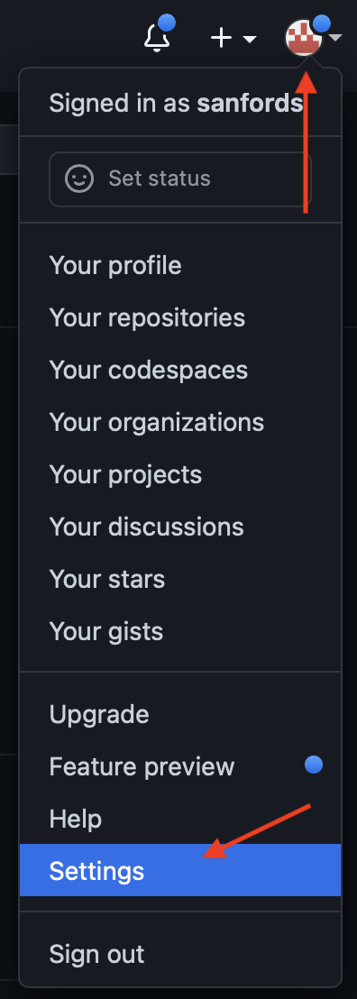

| Git for Smarties |
| :--------------: |
|    Draft [1]     |
| September, 2022  |

|           Ascending Node Technologies            |
| :----------------------------------------------: |
| [ascendingnode.tech](https://ascendingnode.tech) |
|                   Prepared by                    |
|                 Sanford Selznick                 |

---

## Introduction

I get it. You're smart. You're a successful scientist. You're a brilliant engineer. You're saving the world. But this git thing, it's a _WTFBBQ!?!?_

Git was written by Linus Torvalds. Yeah, the Linux guy. But more than a Linux guy, Linus is a file systems guy. And file systems guys think a bit different from the rest of us. And that makes git a little trickier.

---

### Quick note for SVN Users

If you've used the subversion revision control system (svn) before, it shares many of its commands with git. But all of those commands mean new things in git. So your old knowledge will be of no use to you.

---

### What's a Revision Control System

A Revision Control System (RCS) tracks all changes to a single folder through time... and across multiple users who all occupy different space. git is the latest (greatest?) RCS that does these things.

I'm not here to defend git. You're obviously here because someone is making you use it. ;-)

I will note, however, that once most users climb the learning curve, they like it better than the alternatives.

---

### Some terminology

**_Repository_** - A repository is a folder. The initial copy lives on a server somewhere in the cloud. (GitLab, GitHub, Bitbucket, etc., they're all servers. Some are free.)

**_Fork:_** A copy of a repository in your account on the server.

**_Clone_** - A clone is your copy of the repository folder. It lives on your computer or some account you have access to.

**_Branch_** - A version of your copy of your folder. With git you can create as
many branches as you like. Have a ball. Each one gets a unique name that represents the stuff you're changing. Just making sure you get this. **A version of a folder is called a branch.** Seriously. Please re-read.

**_Checkout_** - The operation of choosing the current branch (version) of your local repository clone (folder).

**_Only one Branch at a time_** - So you've cloned the repository (folder) to your local computer. And that repository (folder) has lots of branches (versions). Only one branch (version) can be active inside that folder at a time. You need to re-read this item.

**_MAGIC:_** Remember we said Linus Torvalds was a file systems guy? This is why. Say the branch (version) named "banana" contains a new file named "sundae.txt". If you switch branches (versions) away from "banana" _"sundae.txt" will disappear_. It will reappear when you switch back to "banana". Crazy, right?

---

### Prerequisites

Question 1: "Do I even have git installed on my computer?"

Pop into a unix/linux terminal and type `which git`. If it spits out a path, you're good. If not, you'll need to install it. If you're on Windows, reach out for help.

This tutorial will cover the basics of command-line git. You may want to investigate any number of the free git clients out there. The rules are the same though. You'll still need to understand git to use them.

See [GitHub Desktop Client](https://desktop.github.com) or [Git Tower Client](https://www.git-tower.com/).

Question 2: Security.

You'll need a private and a public key set up. The private key will remain on your computer and the public key will go into your github account here. You'll literally paste it in there. See the pictures below.

If you don't have an SSH Key, see these [instructions](https://docs.github.com/en/authentication/connecting-to-github-with-ssh/generating-a-new-ssh-key-and-adding-it-to-the-ssh-agent).

Don't ignore setting up your ssh key. If you don't do this, you will have a bad time. Who wants that?

---

### GitHub

GitHub is a bit different from other git repositories. When you _fork_ (copy) the repository, you get a copy of the repository in your GitHub account. Weird right? The copy is what you'll pull down to your computer.

---

### Step 1, Getting your copy of the repository to your computer

1. In your browser, go to the [space coronograph design documents repository](https://github.com/uasal/spacecoron_design_docs).

2. Push the "Fork" button menu. It's named "Fork". It's got a little dealey on it like this:

3. Go to your account and check out your own _private_ copy of the repository. This is the account you'll party on with your edits.

### Step 2, Editing

4. For starters, you can't really edit well right on the GitHub web site. So we need to clone (download) your copy of the repository (in your account) to your computer.

5. Open your terminal program and go to some folder where you want your clone to go. Your home directory is a good choice.

6. Finally we get to clone. Click these buttons to copy the SSH URL to your clipboard:

6. In to terminal type `git clone <the url copied above>.

7. You're done.

---

### Step 3, Partying on the repository

1. You've got a folder. Have fun. But...

2. If you're a beginner:

   - Don't rename folders
   - Don't move files
   - Don't move folders.

3. You're done.

---

### Step 4, Sending your changes back to GitHub.

All this time git was tracking all of your changes behind your back. Crazy, right? Now we have to tell git which changes you want to keep. So:

1. In terminal `cd <directory of repository>.

2. Utter `git status`. This will reveal a list of files that have been created or changed. For each change you have one of two choices. **And this is a hard wall. All files must be considered to continue.**

- Revert the file.

  `git checkout filename` where filename is the name as it appeared in the list above.

- Accept the changes.

  `git add filename` where filename is the name as it appeared in the list above.

3. THe next step is to commit your change: `git commit -m "I like ice cream sundaes."`

4. Utter `git push`.

5. You're done locally!

---

### Step 5, Asking Ewan to merge your changes back

1. Go to the original [space coronograph design documents repository](https://github.com/uasal/spacecoron_design_docs) web page.

2. Create a new pull request.

Note: "Why pull request?" You're basically making a request to Ewan to pull, inspect, and accept your changes. It's ridiculous, I know.

3. Setup your pull request

4. Create it.

5. You're done!
