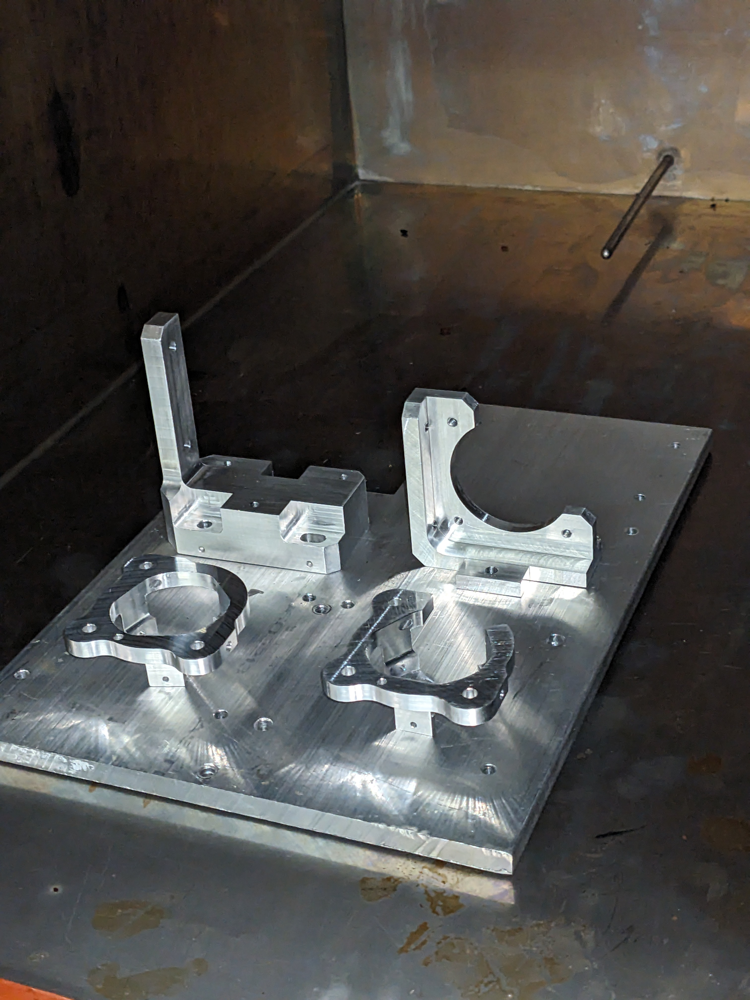
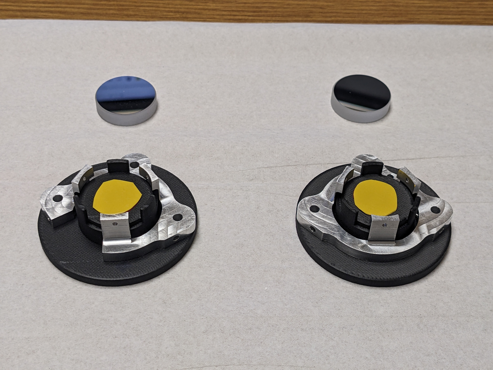
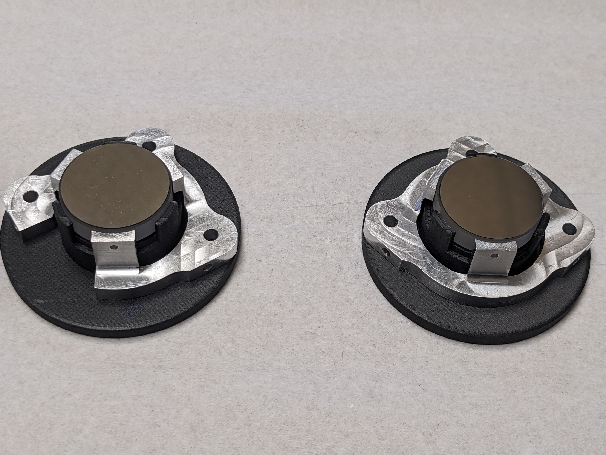
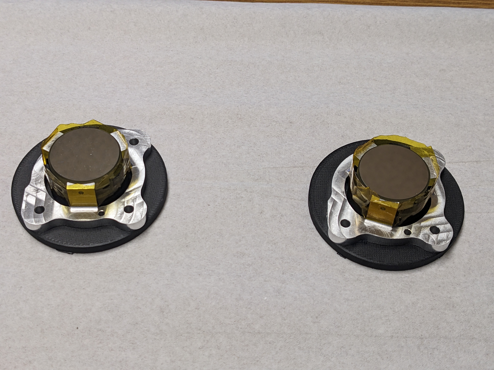
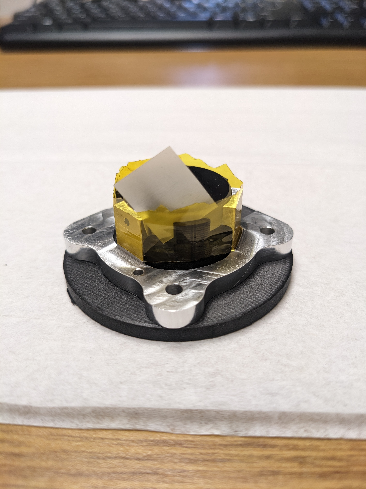
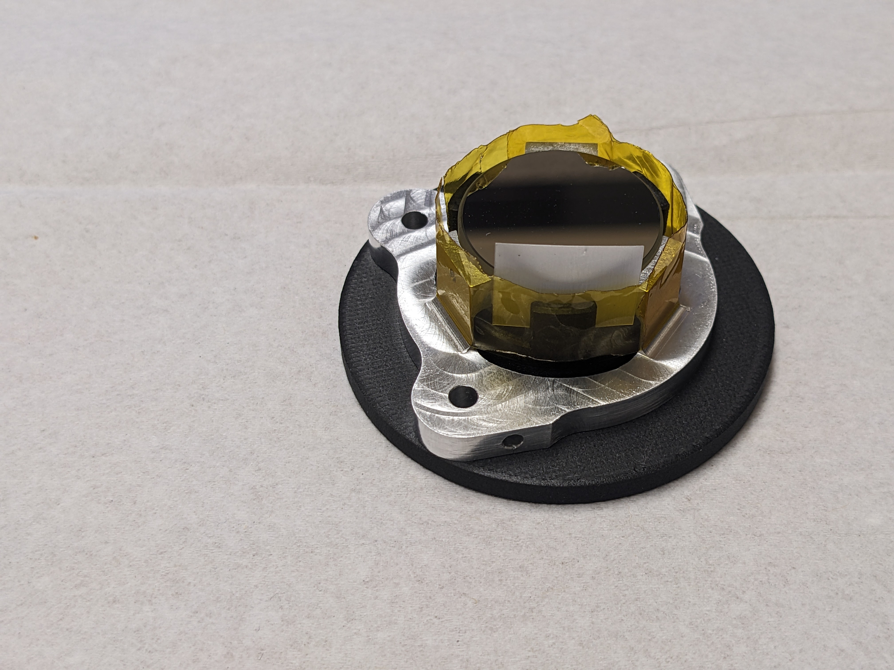
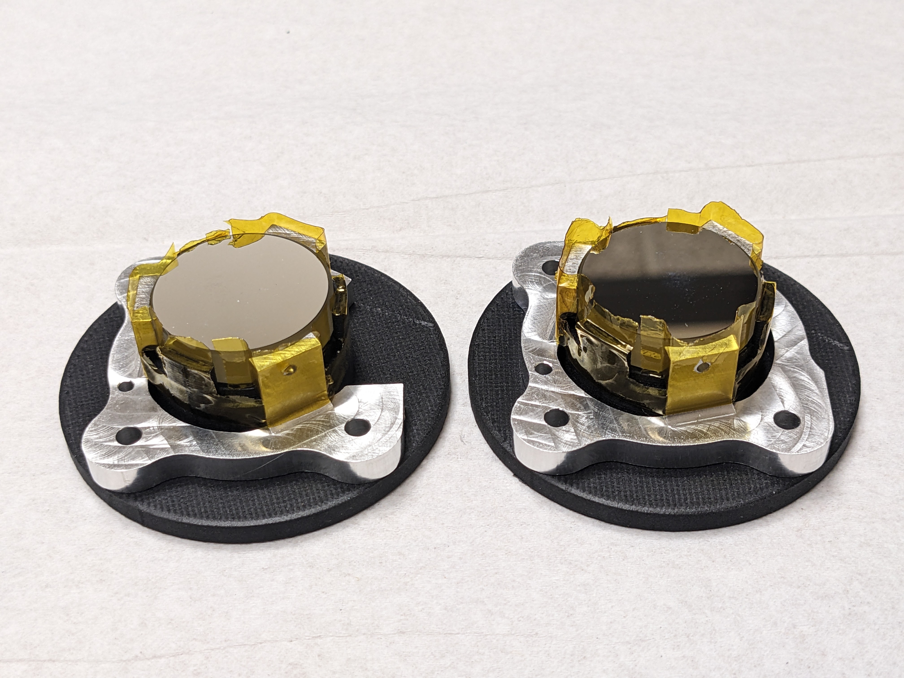
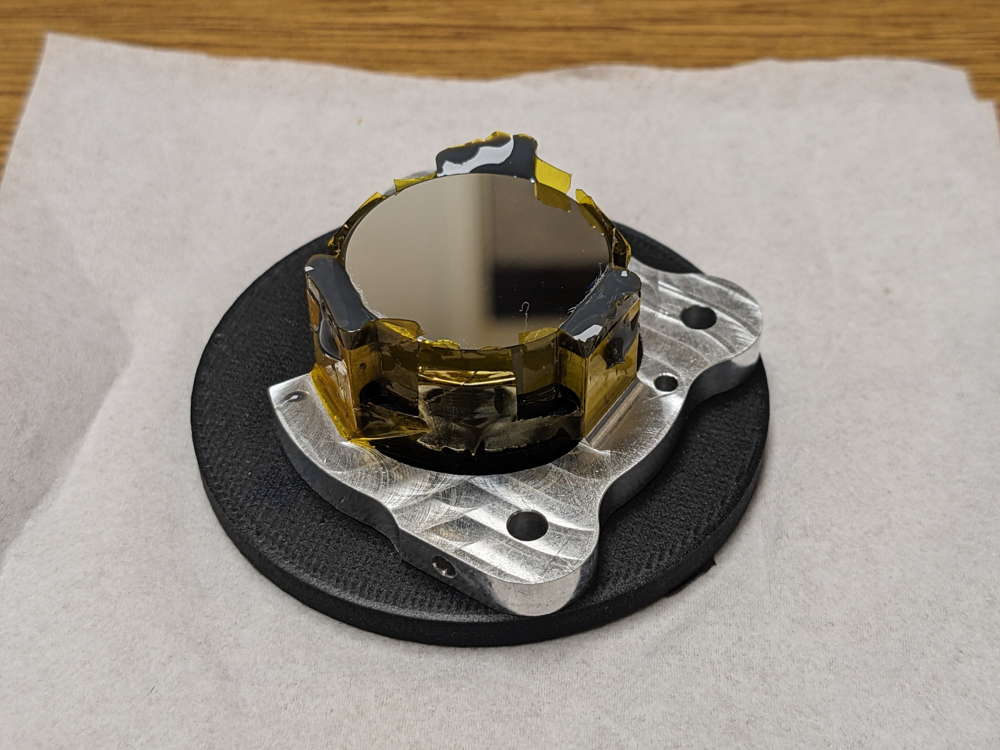

# Optic Bonding Procedure

This procedure details the process of bonding an Zerodur or equivalent near-zero-CTE optic into an **Invar** or equivalent near-zero-CTE optic mount for vacuum optical systems. Example photos illustrate the procedure for the ruggedized mirror mount described in  Huie, R., Mears, A., Montoya, M., Vargas, D., West, G., Hofstadter, D., & Douglas, E. S. (2024, September 1). Design and Test of Small Mirror Supports for Harsh Environments. arXiv E-Prints. https://doi.org/10.48550/arXiv.2409.04403

## Parts List

| Part Description               |Part Number                          |Quantity                         |
|-------------------------|-------------------------------|-----------------------------|
|Optic | |     1   |
|Optic Mount | |   1     |
|Epoxy | 3M 2216 A/B Gray |   1     |
|Scale |  |   1     |
|Syringe | 5ml with TBD tip |   1     |
|Bonding Jig |  |   1     |
|Vacuum wand|  |   1     |
|Kapton Tape | 1/2" |   a/r    |
|Acetone | |   a/r     |
|Kimwipes | |   a/r     |
|Isopropyl Alcohol | |   a/r     |
|Plastic shims | |   a/r     |
|Thermal chamber | |  1     |

## Procedure

### Part Cleaning
1. [ultrasonically clean the machined parts](https://github.com/uasal/spacehardwarehandbook-public/blob/main/space_optics_cleaning.md#cleaning-plan)
1. Thoroughly wipe down the optic mount with acetone and kimwipes
2. Wipe down the optic mount with isopropyl alcohol and kimwipes
3. Visually inspect the optic mount. Repeat Steps 1-2 as needed.
4. Place the mount on a clean surface in the thermal bake-out chamber.  Set the chamber to 60 degrees celsius and bake for at least 7 hours. 
- [ ] Record Start Time: _____________________
- [ ] Record End Time: _____________________

5. Allow mount to cool to room temperature before removing (>2 hrs)

### Bonding Prep
 1. Mount the optic mount on the bonding jig. 
 2. Use the vacuum wand to install the optic in the optic mount on the bonding jig.  
 3. Use shims to adjust the height of the optic in the optic mount so that the front face of the optic is level with the flexures. 
 
 

 4. Apply the kapton tape around the edge of the optic and optic mount to seal create a barrier for the 2216 epoxy.  
	4.1. Use long strip around the optic as a collar
     
	4.2. Cut vertical strips into the tape around each of the jig’s 3 retaining walls. Use a plastic shim between the optic and flexure arm during cutting to prevent any accidental contact between the blade and optic.
    
    
    

	4.3. Using a sturdy shim, press the tape down firmly at each vertex of the flexure arm to ensure good contact and a tight seal around each arm.
	4.4. Cut holes at the 3 potting holes locations to allow for full syringe insertion.

### Bonding
1. Mix the 2216 a/b using a calibrated scale to achieve the correct  ratio by mass. Stir throughly.  Note working time of 2216 is 90 minutes.  Plan to complete this section within 30 minutes. 
- [ ] Record Mass of Part  A: _____________________
- [ ] Record Mass of Part B: _____________________
- [ ] Record start time: _____________________
2. Pour the mixed epoxy into syringe. Weigh filled syringe.
 - [ ] Record mass of epoxy plus syringe: _____________________
3. Insert the syringe into each potting hole and inject the epoxy by going around the optic a few times until slight oozing was present at each arm. This should use ~0.2g of epoxy in total.
 - [ ] Record finish time: _____________________
  
4. Use the remaining epoxy and a small tin cup to create a witness sample.  Allow to cure with the mount. 
5.  Cover the setup and allow the epoxy to cure for at least 24 hours before handling. After 24 hours inspect the witness sample to the epoxy cured correctly. 
6. Clean up excess epoxy with alcohol.
7. Full cure takes 7 days at room temperature.  
