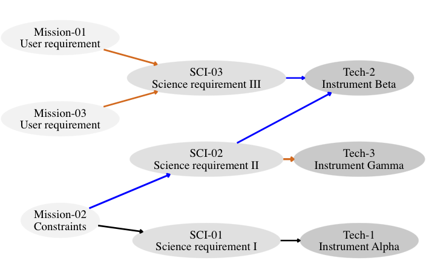
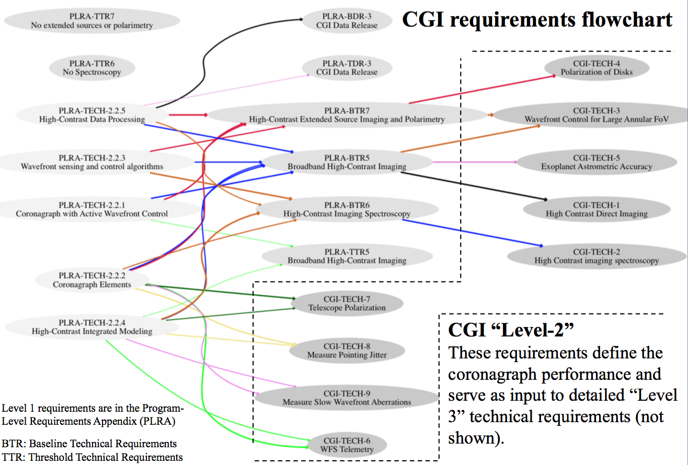

Requirements Definition For Space Science Missions
==================================================

Background
----------

Portions of this text are adapted from `Douglas, Carlton, et al 2016 <https://www.arxiv.org/abs/1807.05422>`__.

Derived from the mission objective(s), requirements describe the necessary functions and features of the system. The requirements establish a basic agreement between the stakeholders and the developers. Requirements are useful for all stages of the mission lifecycle [1]_ [2]_. Requirements are quantitative in nature and should not impose a solution, rather they establish a set of numerical requirements and/or constraints that correspond to the desired operational and functional capabilities that will meet the mission objective(s). Requirements follow a general hierarchy: mission goal/objective, top level and system-level requirements, and then subsystem requirements.

Lower-level requirements are mapped to parent requirements, providing what is known as "requirements traceability."


   
   Example requirements flow.

There are three main types of requirements.

1. Functional requirements are a statement of some *thing* you need (a function). They can be such things as "Payload data shall be communicated to the ground", or "Desired orbit X shall be maintained for Y duration."
2. There are also performance requirements, which define a *characteristic* of something you need, *i.e.*, how much of a function.
3. The third type of requirement are constraints, which set limits on certain resources and define quantities that cannot be traded off with respect to cost, schedule, etc. Additional requirements (which generally fall within the previous three types) are interface, environmental, reliability, and safety requirements.

When writing requirements, one should aim for concise, explicit wording, often using "shall" statements and action verbs. All requirements must be quantifiable and verifiable. Each requirement must include the method by which the requirement will be verified, such as by test, by analysis, by inspection, and/or review of the design. There must be a rationale as to why that specific requirement exists. The rationale should also include any assumptions and document relationships (with links or report numbers) and any relevant design constraints. Requirements should also include revision dates and follow good engineering practices, such as including units. In summary, each requirement typically includes the following information: Requirement ID (for referencing purposes), level, requirement text, rationale, traced from / parent ID, owner/responsible party, verification method, and the date of last modification. Ideally the user will also supply a 1-sentence verification plan summary as it can add aid in communicating scope and expectation regarding the verification effort.
For more details on designing requirements, the reader is encouraged to review Chapter 4 of the "NASA Systems Engineering Handbook" [1]_.

An example requirements flow is shown above, representing a simple three level flow from mission to science and technical requirements. Higher level requirements start on the left with light gray and lower level requirements are on the far right in darker gray. Different line-weights and colors connect to each downstream requirements, helping to trace the upstream parents of a requirement in complex requirements documents.

Requirements Management Tools
-----------------------------

A variety of tools have been employed to keep requirements up-to-date and minimize creep. These including Microsoft Excel, Dynamic Object Oriented Requirements System (DOORS), rmToo, and many commercial software products that utilize Model-Based System Engineering (MBSE) methodologies. Each approach has strengths and weaknesses and some are briefly described below.

A spreadsheet (or collection of sheets) can be used as a relational database for requirements, with the benefit that it is easy for users parse and the software, such as Microsoft Excel and OpenOffice, is familiar to many people. However, spreadsheets are challenging due to version control (passing spreadsheets around for editing), the number of sheets needed for larger projects, and, on its own, spreadsheet software does not automatically produce a corresponding formal requirements document.

The Dynamic Object Oriented Requirements Management System (DOORS) is an commercial object-oriented database, where each requirement is an "object", rather than a row in a relational table [3]_. DOORS is widely used in aerospace engineering. However, the system requires purchased licensing and this may limit the number of active participants in the requirements development and editing process.

Model-Based Systems Engineering (MBSE) tools for requirements management integrate models, analyses, budgets, and other system constraints together. MBSE creates a fully traceable system of requirements and interactions and is able to capture dependencies. In using MBSE tools, there can be logistical and technical challenges, such as organizational and cultural change and training. [4]_ [5]_. rmToo is an open-source requirements management tool [6]_ with a command line interface, relying only on input and output files rather than a special tool set environment. rmToo also allows for version control by integrating with git.

Doorstop
~~~~~~~~

Managing versions across a large, diverse team becomes problematic when multiple contributors have concurrently modified requirements. A modern decentralized version control system such as *git* [7]_ [8]_ or *mercurial* [9]_, where revisions are tracked with automatic character-by-character change logs, greatly simplifies merging divergent requirements documents. Dependency visualization, creating a flowchart of interdependencies and links between requirements, allows intuitive and rapid vetting of requirement structure and link relevance. Distribution of the requirements in spreadsheet form is inconvenient for presentation and sharing with stakeholders. For verbal presentations, slides are typically more useful, while manuscript form documents are often needed for formal record keeping.

To overcome these challenges, we built an infrastructure around the Doorstop [10]_ Python requirements management tool. Doorstop is fully featured open source "requirements management tool that facilitates the storage of textual requirements alongside source code in version control". Doorstop imports a requirements management spreadsheet from Excel or CSV and parses it into a tree of human-readable YAML files (one per requirement), tracking and validating links between requirements, and publishing hyperlinked requirements documents in HTML or Markdown formats or exporting as new csv and Excel tables.

Space Heritage
~~~~~~~~~~~~~~

Doorstop is actively developed with over 50 contributors and numerous software industry users and supporters. For space programs, Doorstop is incorporated, along with FRET, into `Space ROS <https://space-ros.github.io/docs/rolling/Related-Projects/Doorstop.html>`__, an open-source software framework, derived from ROS 2 that will be hardened to be compatible with the demands of safety-critical space robotics applications developed by NASA and Blue Origin. The implementation described here is supported by UA Space Astrophysics Lab and was developed at the MIT STAR lab (Funded by WFIRST Science Investigation team prime award #NNG16PJ24) where it was used on the WFIRST coronagraph (Douglas et al 2016) and the the DeMi mission. At UA, the CDEEP mission concept and multiple other space telescope program (STP) development efforts.

Customization
~~~~~~~~~~~~~

**UASAL maintains a custom fork of Doorstop with added features: https://github.com/uasal/doorstop_uasal**. Many of these features are
focused on traceability and publication for formal reviews.
In addition to the core features, we developed a suite of scripts to leverage Doorstop's support for link tracking and version control. The doorstop API allows easy parsing of links to autogenerate dependency visualization using `Graphviz <https://github.com/xflr6/graphviz>`__ [11]_ [12]_ [13]_.
The Graphviz *dot* tool positions nodes to minimize the number of edge (connecting lines) crossings and edge length [14]_, producing *dot* graphs to visualize the requirements flow as illustrated for WFIRST in :numref:`cgiflowchart`. These charts allow rapid identification of erroneously connected or disconnected requirements and illustrate natural groupings and interdependencies.

.. _cgiflowchart:


   WFIRST CGI requirements flow from objectives to Level 2. Level 2 requirements are outlined by the dashed line. Version 4.8, ``git commit:1a54825```. This flowchart was automatically generated using Graphviz and Doorstop (see Section :ref:`sec:approach`).

Template for space science missions
~~~~~~~~~~~~~~~~~~~~~~~~~~~~~~~~~~~

A template to reproduce this figure using the tools described here is available via Github (`<https://github.com/douglase/doorstop_requirements_template>`__) and archived using Zenodo (`<https://zenodo.org/records/1245989>`__). Other features include customized markdown output files using Pandoc [15]_ which allows of simple hyperlinked publication markdown pages (e.g. for realtime publication on `<https://www.github.com>`__) as well as automated generation of presentation slides using LaTeX Beamer format, annotated with a unique revision number and git commit hash for traceability.

.. [1] hirshorn_nasa_2017
.. [2] SMAD
.. [3] DOORS
.. [4] Bayer_2012
.. [5] Bayer_2013
.. [6] `<http://rmtoo.florath.net/>`__
.. [7] _git_2018
.. [8] Blischak_quick_2016
.. [9] _mercurial_
.. [10] browning_doorstop_2014
.. [11] ellson_graphviz_2001
.. [12] bank_graphviz_2018
.. [13] _graphviz_
.. [14] ellson_graphviz_2001
.. [15] macfarlane_pandoc_2017